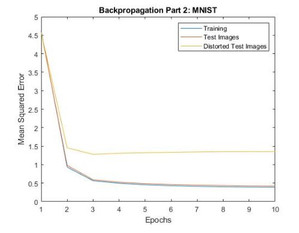
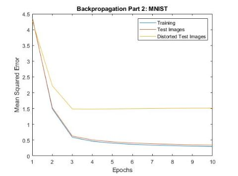
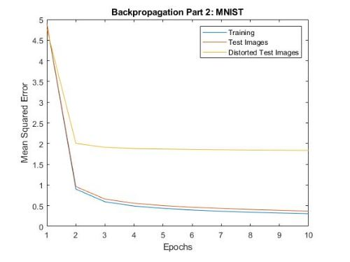
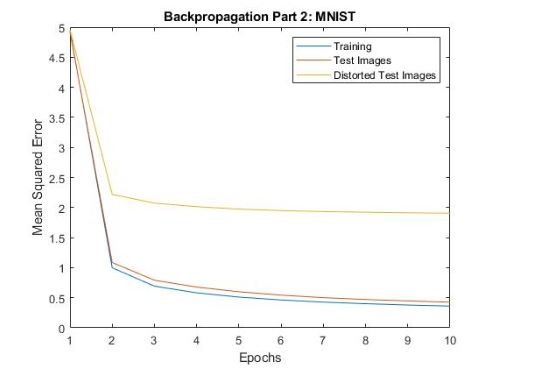

# Backpropagation-Matlab
Classifying MNIST Handwritten Images using ANN Backpropagation algorithm in Matlab

In this assignment we worked with the MNIST database of 60k handwritten training images and 10k test images. Using a two layer ANN with log-sigmoid transfer functions and backpropagation we trained our network on the training images in order to classify the handwritten digits. Our code includes ten target pattern outputs (0 through 9). We increased our hidden units to 50, and modified our learning rate to 0.00005. As stated on the MNIST databse website, the test images are half normal random samples from the training set, and half distorted digits. Because of this we broke the 10k test images into two categories: 5k for “test images” and 5k for “distorted test images”. The training happens in the main loop which represents one single epoch. During each epoch we complete the forward pass with the training images, the testing of both the normal and distorted test images, and finally the backward pass to update the weights and bias’. During the backpropagation training we stored the error values for the training set and divided test set images in vectors, then took the mean in order to observe the mean squared error and epoch relationship seen below in figure 1.

 
The results of our backpropagation training show that the mean squared error for the training and normal test images is nearly identical during each epoch. This is expected since the patterns are not distorted. We can also see that the distorted test images have a slightly higher MSE and reach a mean squared error around 1.5 after the tenth epoch. These results were not surprising to us since the distorted images are more prone to incorrect classification.

The aspect of this ANN architecture that we chose to explore was the number of hidden units. Our original number of hidden units was 50 and the results of the network’s performance can be seen above in figure 2.3. When modifying the number of hidden units to higher numbers, such as 100, 500 and 1k hidden units, the network’s performance with the test set produced a higher MSE. These results can be seen in the figures 2, 3, and 4 below.

Overall, the relationship between the hidden units, the learning process, and the resultant network's performance on the test set show that with a higher number of hidden units the MSE will increase. This relationship is also true for the distorted test images which show in the above figures that the MSE increases as the number of hidden units increases.
